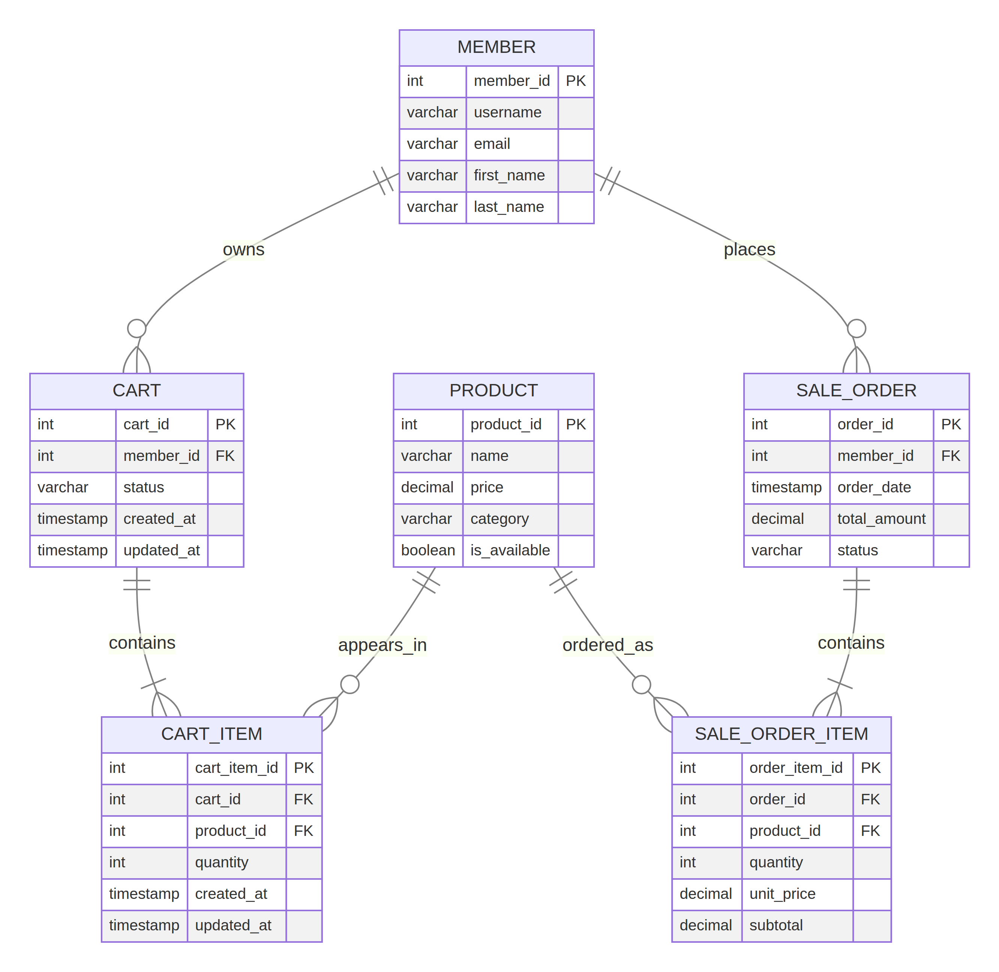

# CA2 Individual Report

| Field | Submission value |
| --- | --- |
| **Name** | `[[REPLACE_WITH_YOUR_FULL_NAME]]` |
| **Student ID** | `[[REPLACE_WITH_YOUR_P_NUMBER]]` |
| **Class** | `[[REPLACE_WITH_YOUR_CLASS]]` |
| **GitHub repository** | `https://github.com/[[YOUR_USERNAME]]/[[YOUR_REPOSITORY]]` |

> **Before submitting:** Replace every `[[...]]` placeholder, push the completed project to a private or public GitHub repository as instructed by the lecturer, and replace the evidence-link base below. The report is intentionally not populated with invented student identity, repository URLs, screenshots, or performance measurements.

**Evidence-link base:** `https://github.com/[[YOUR_USERNAME]]/[[YOUR_REPOSITORY]]/blob/main/`

---

## 1. Database Design and ORM Modeling

### What was done

The original restaurant database was extended with two new entities: **Cart** and **CartItem**. A member can own historical carts but has only one active cart at a time, enforced by a partial unique index. A cart contains one or more cart items, while each cart item connects one cart to one product and retains a positive quantity. The checkout operation converts the active cart into one `sale_order` with one or more `sale_order_item` records. The design therefore separates a mutable pre-purchase cart from an immutable purchase record, preserving the unit price and subtotal at the time of purchase.

The Prisma schema maps the existing snake_case PostgreSQL tables and columns to readable camelCase application fields using `@map` and `@@map`. The two new models are `Cart` and `CartItem`; the schema also maps `Member`, `Product`, `SaleOrder`, and `SaleOrderItem` so Prisma can traverse the relationships used by cart management. Prisma Client is generated after validation, and the runtime client is configured with Prisma’s PostgreSQL driver adapter. Prisma’s current setup guidance requires a PostgreSQL driver adapter when constructing the client in this runtime pattern. [1]

| Design decision | Rationale |
| --- | --- |
| Separate `cart` from `sale_order` | A cart changes frequently, whereas an order is a committed business record. This prevents accidental changes to historical orders. |
| `UNIQUE (cart_id, product_id)` on `cart_item` | The same product is represented by one row in a cart; adding it again increments its quantity instead of producing duplicates. |
| Partial unique active-cart index | `uq_cart_one_active_per_member` permits cart history while enforcing at most one `ACTIVE` cart per member. PostgreSQL supports partial indexes through a `WHERE` predicate. [2] |
| Unit price and subtotal in `sale_order_item` | Order history remains accurate even if a product price changes later. |
| Availability revalidated during checkout | Product availability can change after an item is added to cart, so the transaction verifies it again before inserting any order data. |

### Best implementation evidence

| Evidence | Link to replace before submission |
| --- | --- |
| Prisma schema mapping and new models | [`prisma/schema.prisma`]([[GITHUB_BASE]]prisma/schema.prisma) |
| Cart migration and integrity constraints | [`database/ca2_cart_checkout_indexes.sql`]([[GITHUB_BASE]]database/ca2_cart_checkout_indexes.sql) |
| Prisma connection configuration | [`config/prisma.js`]([[GITHUB_BASE]]config/prisma.js) |

**Self-rating:** `[[CONFIRM_5]] / 5`

---

## 2. Cart Management Feature Implementation

### What was done

The product listing no longer places a one-item order directly. Instead, the member selects a quantity and chooses **Add to Cart**. The browser posts to `POST /cart/items`; the protected controller validates positive integer identifiers and quantities, and then uses Prisma in the `Cart` model to obtain the active cart and upsert the product. The upsert prevents duplicate product lines by incrementing an existing quantity. The Cart page displays all items, individual subtotals, a total item count, an order total, plus/minus quantity controls, and item removal. Every cart route requires a logged-in user with the `USER` role.

The code performs validation in more than one layer. Client-side controls prevent common input errors, the controller rejects invalid request values, the database enforces `quantity > 0`, and the model checks whether the product exists and is available. Ownership is enforced by locating a cart item only within the requesting member’s active cart.

| Layer | Implementation | Purpose |
| --- | --- | --- |
| Front end | `views/products.html`, `views/cart.html`, `public/js/cart-ui.js` | Add products, show cart count, update/removal controls, totals, feedback messages. |
| Route | `routes/cart.js` | Defines authenticated customer-only `GET`, `POST`, `PATCH`, and `DELETE` cart endpoints. |
| Controller | `controllers/cartController.js` | Validates request values and maps errors to safe HTTP responses. |
| ORM model | `models/Cart.js` | Uses Prisma `findFirst`, `create`, `upsert`, `update`, and `delete` operations. |
| Database | `cart`, `cart_item`, check/unique/FK constraints | Guarantees valid quantities, valid references, and one product row per cart. |

### Best implementation evidence

| Evidence | Link to replace before submission |
| --- | --- |
| Cart routes and role protection | [`routes/cart.js`]([[GITHUB_BASE]]routes/cart.js) |
| Prisma cart operations | [`models/Cart.js`]([[GITHUB_BASE]]models/Cart.js) |
| Cart page UI and error/success states | [`views/cart.html`]([[GITHUB_BASE]]views/cart.html) |

### Screenshot evidence to insert

1. Insert a screenshot showing a product added successfully and the cart badge increasing.
2. Insert a screenshot of the Cart page showing at least two products, quantity controls, subtotals, and the order total.
3. Insert a screenshot of an error path, such as entering an invalid quantity or attempting to add an unavailable product.

**Self-rating:** `[[CONFIRM_5]] / 5`

---

## 3. Checkout Feature Implementation

### What was done

The Checkout page retrieves a server-generated preview through `GET /checkout/preview`. It displays the products, quantities, unit prices, subtotals, item count, and total. Checkout is disabled if the cart is empty or if any product has become unavailable. Selecting **Confirm and Place Order** calls `POST /checkout`, which executes the `place_order_from_cart` stored procedure. The application returns a success confirmation only after the procedure returns an order identifier and the backend successfully queries the committed order summary.

The implementation is extensible because the cart and checkout boundary is explicit. A future payment provider, delivery address, coupon, tax, or payment-status field can be added to the checkout input and `sale_order` model without changing how the cart collects items. Storing a unit price and subtotal per order item also lets future price changes remain independent from historical orders.

| Scenario / business rule | System behaviour |
| --- | --- |
| Empty cart | Checkout preview returns `can_checkout: false`; the stored procedure rejects checkout with `Cannot check out an empty cart.` |
| Product no longer available | Cart management informs the member; checkout is disabled; stored procedure rechecks availability under lock and rejects the order. |
| Valid multi-item cart | Stored procedure creates one `sale_order`, inserts one row per cart item into `sale_order_item`, marks the cart `CHECKED_OUT`, and returns the order ID. |
| Duplicate checkout or concurrent request | The active cart is locked with `FOR UPDATE`; after one successful checkout, no active cart remains to create a duplicate order. |
| Unauthenticated request | Cart and checkout routes redirect to `/login` for pages or return an error response for API requests. |

### Best implementation evidence

| Evidence | Link to replace before submission |
| --- | --- |
| Checkout API controller | [`controllers/checkoutController.js`]([[GITHUB_BASE]]controllers/checkoutController.js) |
| Checkout routes | [`routes/checkout.js`]([[GITHUB_BASE]]routes/checkout.js) |
| Checkout page | [`views/checkout.html`]([[GITHUB_BASE]]views/checkout.html) |

### Screenshot evidence to insert

1. Insert a checkout-review screenshot showing a multi-item cart and the Confirm button.
2. Insert a successful order confirmation showing the generated order ID, status, item count, and total.
3. Insert one business-rule/error screenshot, for example an unavailable product that prevents checkout.

**Self-rating:** `[[CONFIRM_5]] / 5`

---

## 4. Transaction Management

### What was done

The transaction procedure is `public.place_order_from_cart(p_member_id, OUT p_order_id)`. It first locks the member’s active cart and its cart-item/product rows with `FOR UPDATE`. It then rejects a missing cart, an empty cart, or unavailable products before any order record is created. Only after validation does it calculate the total, insert the `sale_order`, insert every `sale_order_item`, and mark the cart as `CHECKED_OUT`.

The procedure keeps the order header, all order lines, and the cart state change within one database operation. This implements the all-or-nothing requirement: if validation or insertion fails, no partially created order should remain. PostgreSQL defines a transaction as an all-or-nothing unit; intermediate states are not visible to other transactions, and a failure prevents partial effects from being committed. [3]

| Test case | Expected evidence |
| --- | --- |
| Successful multi-item checkout | One new `sale_order`, multiple matching `sale_order_item` rows, correct total, cart status `CHECKED_OUT`. |
| Empty cart rejection | Error message shown and order count remains unchanged. |
| Unavailable-product rejection | Error message shown and no new order or order item is inserted. |
| Concurrent protection | Explain in the demonstration that `FOR UPDATE` serialises access to the active cart/product rows during checkout. |

### Best implementation evidence

| Evidence | Link to replace before submission |
| --- | --- |
| Stored procedure and locking logic | [`database/ca2_cart_checkout_indexes.sql`]([[GITHUB_BASE]]database/ca2_cart_checkout_indexes.sql) |
| Transaction test cases | [`database/checkout_test_cases.sql`]([[GITHUB_BASE]]database/checkout_test_cases.sql) |
| Controller that invokes the procedure | [`controllers/checkoutController.js`]([[GITHUB_BASE]]controllers/checkoutController.js) |

### Screenshot evidence to insert

Run `database/checkout_test_cases.sql` against the restored database and insert screenshots for the three test cases in the table above. Include the verification query after the failure test so the marker can see that the database did not retain a partial order.

**Self-rating:** `[[CONFIRM_5]] / 5`

---

## 5. Indexing

The project proposes six B-tree indexes that match the filtering, join, and ordering patterns used by the application. PostgreSQL documents that indexes can improve performance but should be selected carefully because unsuitable indexes may add overhead. [2] The evidence must use the actual execution plans on the restored database rather than invented timings. `EXPLAIN (ANALYZE, BUFFERS)` executes the query and adds actual runtime statistics; its output also shows whether PostgreSQL selected an index scan. [4]

| Query ID | Proposed application query | Index type and SQL | Why this index is appropriate | Evidence to capture |
| --- | --- | --- | --- | --- |
| Q1 | Load a member’s active cart. | B-tree: `CREATE INDEX idx_cart_member_status ON cart (member_id, status);` | Matches equality predicates used to find the current cart. | `EXPLAIN (ANALYZE, BUFFERS)` output showing plan and actual execution time. |
| Q2 | Find cart items for a product. | B-tree: `CREATE INDEX idx_cart_item_product_id ON cart_item (product_id);` | Supports product-centric checks and future reporting. | Plan output showing the selected access path. |
| Q3 | Display a member’s recent order history. | B-tree: `CREATE INDEX idx_sale_order_member_order_date ON sale_order (member_id, order_date DESC);` | Aligns with the member filter and descending date order. | Plan output for the order-history query. |
| Q4 | Filter the admin dashboard by status and recency. | B-tree: `CREATE INDEX idx_sale_order_status_order_date ON sale_order (status, order_date DESC);` | Aligns with the status predicate and recency sort. | Plan output for the dashboard query. |
| Q5 | Display available products in a category. | B-tree: `CREATE INDEX idx_product_available_category ON product (is_available, category);` | Matches the page’s availability/category filtering pattern. | Plan output for the product query. |
| Q6 | Display product-specific order-item history. | B-tree: `CREATE INDEX idx_sale_order_item_product_order ON sale_order_item (product_id, order_id);` | Matches a product equality filter and supports order-based reporting. | Plan output for the product-order query. |

Run [`database/index_benchmark.sql`]([[GITHUB_BASE]]database/index_benchmark.sql) after the migration. For each query, insert a screenshot of the plan and state the **actual** plan node, planning time, execution time, and a short explanation of why PostgreSQL did or did not use the index. A small dataset can legitimately produce a sequential scan because it is cheaper; explain the real planner choice instead of claiming an index scan that did not occur.

**Self-rating:** `[[CONFIRM_5]] / 5`

---

## Report quality and final evidence checklist

The report uses specific code links, explains design choices, distinguishes automated checks from live-database evidence, and identifies the screenshots required for the final submission. To maximise report quality, I will replace all placeholders, insert the listed screenshots, verify each hyperlink by opening it while signed out of GitHub if the repository is public (or while using the marker’s permitted access method if private), and ensure the same commits are visible in the repository.

| Final check | Complete? |
| --- | --- |
| Personal details and GitHub base link replaced | `[[YES/NO]]` |
| ERD reproduced/exported from Lucidchart as required by the template | `[[YES/NO]]` |
| Cart success and error screenshots inserted | `[[YES/NO]]` |
| Checkout success and business-rule screenshots inserted | `[[YES/NO]]` |
| Transaction success/failure screenshots inserted | `[[YES/NO]]` |
| Six actual `EXPLAIN (ANALYZE, BUFFERS)` screenshots inserted | `[[YES/NO]]` |
| Every GitHub hyperlink tested | `[[YES/NO]]` |

## References

[1]: https://www.prisma.io/docs/prisma-postgres/quickstart/prisma-orm "Prisma ORM quickstart: PostgreSQL driver adapter"
[2]: https://www.postgresql.org/docs/current/sql-createindex.html "PostgreSQL: CREATE INDEX"
[3]: https://www.postgresql.org/docs/current/tutorial-transactions.html "PostgreSQL: Transactions"
[4]: https://www.postgresql.org/docs/current/sql-explain.html "PostgreSQL: EXPLAIN"
